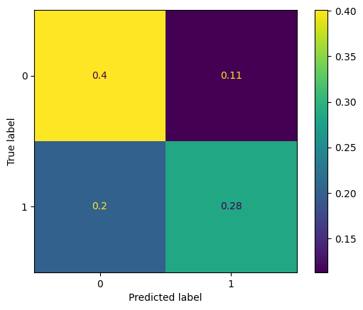

# Lab Evaluation

Names, Surnames, and Group : (to complete by 2 students)

**Bastian Krohg and Nicolas Siard,
4th year AE-SE - Group 1**

In the following, we consider the  (binarized) Compas dataset that we studied in the Lab

Q1: A decision tree configuration is a set of parameters that one can use to build decision trees. Propose 6 configurations that are likely to provide different topologies and caracteristics


```python
#Useful packages
##to create trees:
from sklearn import tree
##to calculate means
import numpy as np
##to import dataset from csv format
import csv
from utils import load_from_csv
##to split datasets
from sklearn.model_selection import train_test_split
##to use cross-validation
from sklearn.model_selection import cross_val_score
##to plot
from matplotlib import pyplot as plt
##to construct confusion matrix and display it
from sklearn.metrics import confusion_matrix, ConfusionMatrixDisplay
```


```python
#Examples
clf_1 = tree.DecisionTreeClassifier()
clf_2 = tree.DecisionTreeClassifier(splitter="random")
clf_3 = tree.DecisionTreeClassifier(min_samples_leaf=15)
clf_4 = tree.DecisionTreeClassifier(max_depth=3)
clf_5 = tree.DecisionTreeClassifier(max_depth=7, min_samples_leaf=20)
clf_6 = tree.DecisionTreeClassifier(max_depth=15, min_samples_leaf=5, splitter='random')
```

Q2: Train a decision tree for each of the previous configurations on the full dataset


```python
#Load dataset
train_examples, train_labels, features, prediction = load_from_csv("./compass.csv")

#Training the 6 trees on entire dataset
clf_1 = clf_1.fit(train_examples, train_labels)
clf_2 = clf_2.fit(train_examples, train_labels)
clf_3 = clf_3.fit(train_examples, train_labels)
clf_4 = clf_4.fit(train_examples, train_labels)
clf_5 = clf_5.fit(train_examples, train_labels)
clf_6 = clf_6.fit(train_examples, train_labels)
```

Q3: Propose an evaluation in terms of training and testing accuracies using $5$-cross validation on two decision trees that have different topologies


```python
#When using k-fold cross validation we start by splitting the dataset into two parts
#Training set (80%) and test set (20%). We use the same split for the two topologies.
##We need the test set to compute a score after fitting and cross-validation to be able to check 
##whether the model is only memorizing the data
x_train, x_test, y_train, y_test = train_test_split(train_examples, train_labels, random_state=1, test_size=0.20) 

#We need to fit/train two of the trees again using only the training part of the data set
clf_1 = clf_1.fit(x_train, y_train)
clf_5 = clf_5.fit(x_train, y_train)

#Get cross-validation scores with cv=5 ("k")
#training scores:
train_scores_1 = cross_val_score(clf_1, x_train, y_train, cv=5, scoring='f1_macro')
train_scores_5 = cross_val_score(clf_5, x_train, y_train, cv=5, scoring='f1_macro')

#testing scores:
test_scores_1 = clf_1.score(x_test, y_test)
test_scores_5 = clf_5.score(x_test, y_test)

#print scores to evaluate which model is most accurate on the training set
print("Classification tree 1")
print(f"Training Score = {train_scores_1}, Testing Score = {test_scores_1}")
print("Classification tree 5")
print(f"Training Score = {train_scores_5}, Testing Score = {test_scores_5}")
```

    Classification tree 1
    Training Score = [0.64559773 0.63728989 0.63316218 0.66782973 0.61631678], Testing Score = 0.6578199052132702
    Classification tree 5
    Training Score = [0.6533743  0.66269281 0.64759515 0.68089002 0.65182347], Testing Score = 0.6824644549763034


Q4: Propose an experimental study that shows the transition phase from underfitting to overfitting 


```python
#Create trees

#Underfitted tree: 
clf_under = tree.DecisionTreeClassifier(max_depth=2, min_samples_leaf=5000, splitter='random')

#Good fit tree:
clf_good = tree.DecisionTreeClassifier(max_depth=7, min_samples_leaf=20, splitter='best')

#Overfitted tree:
clf_over = tree.DecisionTreeClassifier(max_depth=None, min_samples_leaf=1, splitter='best')

#Training
clf_under = clf_under.fit(x_train, y_train)
clf_good = clf_good.fit(x_train, y_train)
clf_over = clf_over.fit(x_train, y_train)

#5-fold cross validation scores
train_score_under = cross_val_score(clf_under, x_train, y_train, cv=5, scoring='f1_macro')
train_score_good = cross_val_score(clf_good, x_train, y_train, cv=5, scoring='f1_macro')
train_score_over = cross_val_score(clf_over, x_train, y_train, cv=5, scoring='f1_macro')

train_scores_table = [train_score_under, train_score_good, train_score_over]
mean_train_scores = [np.mean(train_score_under), np.mean(train_score_good), np.mean(train_score_over)]

#Testing scores
test_score_under = clf_under.score(x_test, y_test) 
test_score_good = clf_good.score(x_test, y_test) 
test_score_over = clf_over.score(x_test, y_test) 

test_scores_table = [test_score_under, test_score_good, test_score_over]

#Visualize test score evolution
print(f"Mean train scores: {mean_train_scores}")
print(f"Test scores: {test_scores_table}")    

```

    Mean train scores: [0.3476646202286332, 0.6592751480242387, 0.6410807535315994]
    Test scores: [0.5137440758293839, 0.6824644549763034, 0.6578199052132702]


Here we notice significant improvement from the (severely) underfitted tree over to the well fitted one, however when going from the good fit and into overfitting, we only see a small decrease in testing performance. 

Q5: Construct the confusion matrix on a particular good configuration (after explaining your choice)


```python
#We choose to reuse the well fitted clf_good, as we noticed that its test scores are decent
#During our lab, we tried to further improve the tree performance by testing different configurations, 
#however we were not able to create a better tree than clf_good.

#Constructing the confusion matrix using the previously optimized tree configuration: clf
y_true = y_test
y_prediction = clf.predict(x_test)

cm = confusion_matrix(y_true, y_prediction, normalize='all', labels=clf.classes_)

#Displaying the confusion matrix
disp = ConfusionMatrixDisplay(confusion_matrix=cm, display_labels=clf.classes_)
disp.plot()
plt.show()
```


    

    


Q6: Provide an evaluation of the fairness of the model based on the False Positive Rate

In this case the False Positive rate (True label = 0, Predicted label = 1) here represents a probability of 11% (upper right corner). This means that 11% of the AI suggestions are advising to incarcerate people who are not going to commit any crimes in the following two year period. This percentage is quite elevated, as more than 1 in 10 of the predictions are going to put people who should not be in prison behind bars. This is an ethical problem, because it has a high error rate and risks putting away the wrong people. It is also biased because of the data set, especially for ethnic groups outside caucasians and afro-american people. The use of this model therefore has to be done with caution.

Moreover, considering the 20% probability of false negatives, a significant amount of the predictions will be wrongful. 

We therefore conclude that the model is a good helper in most cases for caucasian and afro-american convicts, but cannot be used as a decision-maker, only to help get an idea. The model is not too fair, because of the big part of innocent people it could potentially put behind bars. 
